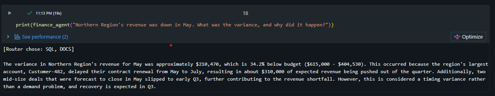
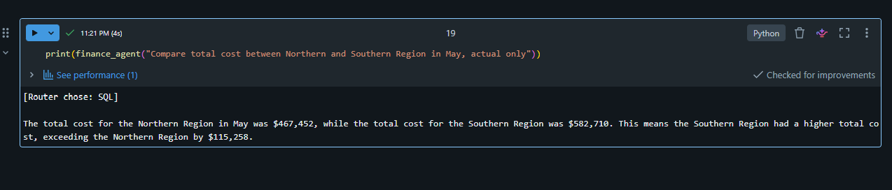

# Databricks Financial Agent 💬📊

A conversational QA agent that answers finance questions by reasoning across **three data layers** — raw transactions, a governed semantic layer, and unstructured commentary — and intelligently routing each question to the right source.

Ask it a number, and it runs **live SQL** for an exact answer. Ask it *why*, and it does **semantic search** over emails and SharePoint commentary. Ask it both, and it combines them into one grounded response.

Built on **Databricks** — Unity Catalog, metric views, Foundation Model APIs, and AI (Vector) Search.

---

## What it does

> **Q:** *"Northern Region's revenue was down in May. What was the variance, and why did it happen?"*
>
> **Router chose: SQL, DOCS**
>
> *"The variance was approximately **$210,470 (34.2% below budget**: $615,000 → $404,530). This occurred because the region's largest account, Customer-482, delayed their contract renewal from May to July, pushing ~$310,000 of expected revenue out of the quarter. Two mid-size deals also slipped to Q3. This is a **timing variance, not a demand problem** — recovery is expected in Q3."*

The numbers came from live SQL over a governed semantic layer. The explanation came from vector search over commentary documents. The agent decided — on its own — that this question needed both.



---

## The problem it solves

In a real enterprise, the answer to a business question is rarely in one place:

- The **KPI layer** tells you *that* a number missed plan.
- The **transactional layer** holds detail that was never modelled into reporting.
- The **explanation** — *why* it happened — lives in an email or a commentary log, written by a human.

A finance manager asking *"why was Northern Region down?"* needs all of it. This agent reaches each layer with the right mechanism and synthesises one answer.

---

## Architecture

```
                    ┌──────────────────────────┐
   User question ──▶│   Router (LLM)            │  decides which tools are needed
                    │   SQL? DOCS? both?        │
                    └───────────┬──────────────┘
                 ┌──────────────┴───────────────┐
                 ▼                               ▼
      ┌────────────────────┐          ┌────────────────────┐
      │  NL2SQL tool        │          │  Vector search tool │
      │  (structured)       │          │  (unstructured)     │
      └─────────┬──────────┘          └──────────┬─────────┘
                ▼                                 ▼
   ┌──────────────────────────┐        ┌────────────────────┐
   │ Silver table (detail)     │        │ AI Search index     │
   │ Metric view (semantic)    │        │ over email +        │
   │  — governed measures      │        │ SharePoint docs     │
   └──────────────────────────┘        └────────────────────┘
                 └──────────────┬───────────────┘
                                ▼
                    ┌──────────────────────────┐
                    │  Synthesis (LLM)          │  combines numbers + context
                    └──────────────────────────┘
```

**Structured data → live NL2SQL** (exact numbers, not retrieval). **Unstructured data → vector search** (semantic retrieval over text). The agent routes per question — the right tool for the right data shape.

---

## Key engineering decisions

| Decision | Why |
|---|---|
| **Governed semantic layer** (Unity Catalog metric view) | The agent queries *defined measures*, so its numbers match official reports — not re-derived from raw rows. Critical for finance. |
| **Live SQL for structured data, not RAG** | Exact aggregations. RAG retrieves text; finance needs computed numbers that reconcile. |
| **Metadata-driven schema context** | The LLM's prompt is generated from catalog comments, not hardcoded — change a description, the agent updates. |
| **Few-shot examples** | Teaches SQL patterns by demonstration, so the agent generalises to unseen question shapes. |
| **Read-only safety guard** | The NL2SQL tool rejects anything that isn't a plain SELECT — no writes, no DDL. |
| **Evaluation harness** | Automated test set scoring routing + answer correctness, so prompt changes are regression-tested, not eyeballed. |

### Reliability — measured, not hoped

The agent is validated by an automated evaluation harness checking both **source routing** and **answer correctness** across question types.


### Intelligent routing — it discriminates

The router doesn't blindly call every tool. A pure number question routes to **SQL only**:



---

## Tech stack

- **Databricks** — Unity Catalog, serverless compute
- **Metric views** — the governed semantic layer (equivalent to a Power BI semantic model)
- **Foundation Model APIs** — hosted LLM for NL2SQL, routing, and synthesis (Llama 3.3 70B)
- **AI Search (Vector Search)** — hybrid semantic + keyword index over documents
- **Delta Lake** — bronze / silver / gold medallion tables

---

## Repository structure

```
notebooks/     the Databricks implementation
data/
  bronze/      raw GL transactions
  silver/      conformed financial detail
  gold/        aggregated KPI facts (source for the metric view)
  unstructured/  representative email + SharePoint commentary
docs/          architecture and demo script
assets/        screenshots of the working agent
```

---

## How the data layers map (medallion)

| Layer | Content | How the agent uses it |
|---|---|---|
| **Bronze** | Raw GL transactions | Drill-down detail not modelled into reporting |
| **Silver** | Conformed financial facts | Standard cost-centre / account queries |
| **Gold → metric view** | Governed KPIs | Plan-vs-actual, variance, the headline numbers |
| **Unstructured** | Email + SharePoint commentary | The *why* behind a variance |

---

## Notes

- **The data is synthetic** — generated to demonstrate the architecture, with a revenue-shortfall story seeded consistently across all layers (Northern Region, May — a client renewal slipping to Q3).
- Built on **Databricks Free Edition** to keep it zero-cost and fully reproducible.
- **Production path:** unstructured sources would be ingested from live email/SharePoint via the Microsoft Graph API on a schedule; the vector index and agent are identical regardless of ingestion source. The `data/unstructured/` files represent that ingested content.

---

## About

Built by **Pooja** — Data & AI Engineer — as a portfolio demonstration of multi-source, medallion-aware agentic retrieval combining live NL2SQL over a governed semantic layer with RAG over unstructured commentary.
